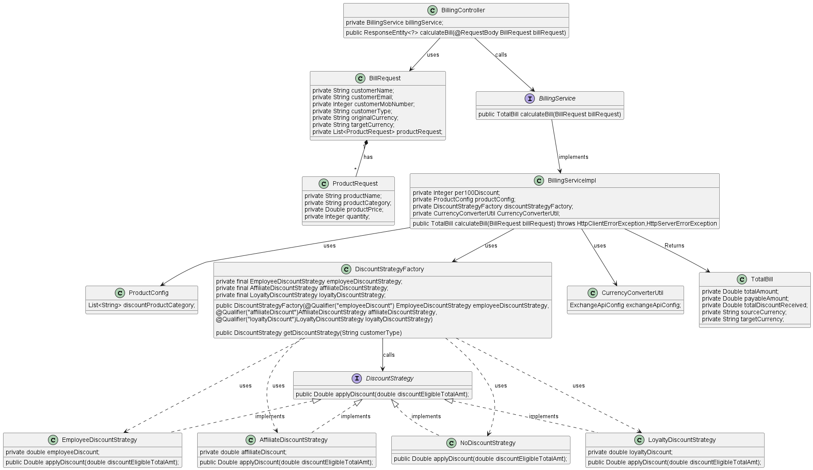

# Currency Exchange and Discount Calculation - Spring Boot Application
Description
This Spring Boot application integrates with a third-party currency exchange API to retrieve real-time exchange rates and calculates the total payable amount for a bill in a specified currency after applying relevant discounts. The application exposes an API endpoint (/api/calculate) that allows users to submit a bill in one currency and get the payable amount in another currency.

The application implements several business rules for calculating discounts, handles currency conversion, and ensures that the final payable amount is computed correctly for the user based on their attributes and the total bill.

# Features
 - Third-Party API Integration: Integration with a currency exchange API (e.g., Open Exchange Rates or ExchangeRate-API) for real-time currency conversion.

 - Discount Logic: Apply various discount rules based on user type, customer tenure, and total bill amount.

 - Currency Conversion: Conversion of the original bill amount to the target currency using real-time exchange rates.

 - Authentication: Endpoints are secured and require authentication.

 - API Endpoint: Exposes /api/calculate to calculate the final payable amount in the specified target currency.

 - Swagger Documentation: API documentation using Swagger UI.

 - The discount percentage and discount on a particular product category can be changed from the application yml 
```yaml
app:
  discounts:
    employeeDiscount: 30.00  # 30% discount for employees
    affiliateDiscount: 10.00  # 10% discount for affiliates
    loyaltyDiscount: 5.00  # 5% discount for customers over 2 years
    per100Discount: 5  # $5 for every $100 on the bill

  products:
    discountProductCategory:
      - electronics
      - Fashion
      - Dairy
      - others
  ```


Requirements
1. Third-Party API Integration
The application integrates with an external API to fetch real-time exchange rates.
Use the API key from the third-party service (e.g., Open Exchange Rates, ExchangeRate-API) to access exchange rates.
Endpoint:
  ```"https://v6.exchangerate-api.com/v6/f7223a9c53816ce40c071c05/latest/{base_currency}" ```

2. Discounts and Currency Conversion Logic
The discount rules are as follows:
Employee: 30% discount.
Affiliate: 10% discount.
Customer for 2+ Years: 5% discount.
$100 Bill: $5 discount for every $100 spent.
Exclusion for Groceries: Percentage-based discounts do not apply to grocery items.
One Discount at a Time: A user can apply only one percentage-based discount.
The bill total is converted from the original currency to the target currency using the retrieved exchange rates.
The final payable amount is calculated after applying the applicable discounts.

3. Authentication
The application requires authentication for the /api/calculate endpoint.

4. Endpoint Exposure
POST http://localhost:8080/api/calculate: Accepts the following details:

```json
{
  "customerName": "John Doe",
  "customerEmail": "johndoe@example.com",
  "customerMobNumber": 1234567890,
  "customerType": "employee",
  "originalCurrency": "USD",
  "targetCurrency": "EUR",
  "productRequest": [
    {
      "productName": "Laptop",
      "productCategory": "Electronics",
      "productPrice": 3000,
      "quantity": 1
    },
    {
      "productName": "Rice",
      "productCategory": "Grocery",
      "productPrice": 2000,
      "quantity": 2
    },
    {
      "productName": "Milk",
      "productCategory": "Dairy",
      "productPrice": 1000,
      "quantity": 5
    },
    {
      "productName": "T-Shirt",
      "productCategory": "Fashion",
      "productPrice": 1500,
      "quantity": 3
    }
  ]
}
```

Response: The final payable amount in the target currency after applying the applicable discounts and currency conversion.
Total Bill 
``` json
{
  "totalAmount": 15331.8,
  "payableAmount": 13770.74,
  "totalDiscountReceived": 1561.06,
  "sourceCurrency": "USD",
  "targetCurrency": "EUR"
}
```

### How to start the application 

mvn spring-boot:run

### How to Test Supermart-billing-service and generate test report 

Using POSTMAN or Browser you can hit the endpoints of supermart-billing-service.
swagger-endpoint - http://localhost:8080/swagger-ui/index.html

After maven clean install jacoco report can be found at the path - target->jacoco-report->index.html->rightclick->open with browser->select any broswer to view the report


## Dependencies

* Java 17+
* Spring Boot 3.2.3

## UML Diagram

Below is the UML diagram representing the architecture of the application:



